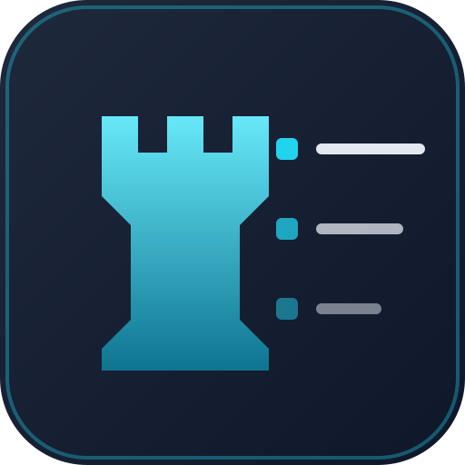
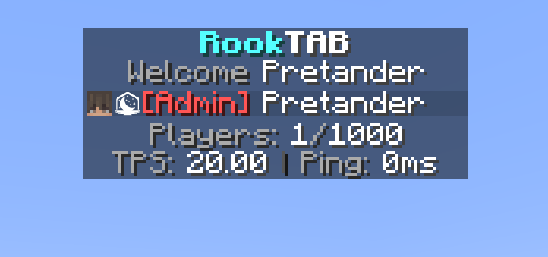

<div align="center">



# RookTAB

**Tab list header, footer, name formatting and sorting plugin for [PumpkinMC](https://github.com/Pumpkin-MC/Pumpkin).**

[](https://github.com/xRookieFight/RookTAB/actions/workflows/ci.yml)
[](https://github.com/xRookieFight/RookTAB/actions/workflows/fmt.yml)
[](https://github.com/xRookieFight/RookTAB/releases)
[](LICENSE)
[](https://www.rust-lang.org)
[](https://component-model.bytecodealliance.org)

</div>

---



---

## Features

- **Header and footer** - multi line, rebuilt on every refresh so placeholders stay live.
- **Name formatting** - the tab list entry is built from a format string, prefix and suffix included.
- **Sorting** - group weight drives the tab list order, reverse it with a single option.
- **Groups** - a permission node per group, so any permission plugin can assign them.
- **Placeholders** - `%player%`, `%ping%`, `%world%`, `%gamemode%`, `%online%`, `%max_players%`,
  `%tps%`, `%mspt%`, `%motd%`, `%group%`, `%group_prefix%`, `%group_suffix%`, `%group_weight%`.
- **Animations** - named frame lists with their own interval, used as `%animation:logo%`.
- **Per world control** - disable the header, the footer or the name format in chosen worlds.
- **Colors** - legacy `&a` codes, formatting codes and `&#RRGGBB` hex colors.
- **Configurable refresh** - one repeating task, the interval is yours to pick.
- **Live reload** - `/rooktab reload` re-reads the config and reapplies it to everyone online.

## Installation

Grab `rooktab.wasm` from the [latest release](https://github.com/xRookieFight/RookTAB/releases)
and drop it into your server's `plugins` folder, then restart. The plugin writes `data/config.json`
with a working default setup on first start.

## Building

```bash
rustup target add wasm32-wasip2
cargo build --release
```

`.cargo/config.toml` pins the build target, the plugin only links as a WebAssembly component. The
artifact lands at `target/wasm32-wasip2/release/rooktab.wasm`.

Tests run against the host target:

```bash
cargo test
```

## Contributing

Bug reports, ideas and pull requests are welcome. Start with [CONTRIBUTING.md](CONTRIBUTING.md), and
report security problems privately through the
[security policy](SECURITY.md).

## License

[MIT](LICENSE) - Copyright © 2026 xRookieFight
